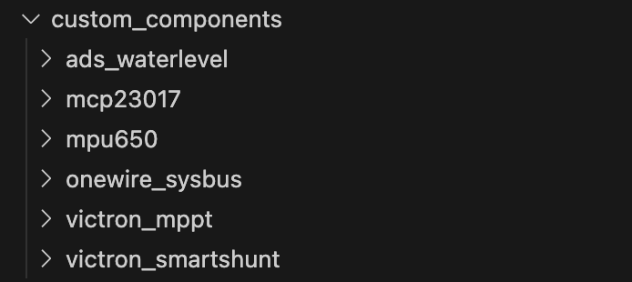

[](https://github.com/custom-components/hacs)

## homeassistant_PekawayVANPICORE

Diese benutzerdefinierte Komponente integriert das VAN PI CORE Board mit Home Assistant und ermöglicht es dir, die Systeme deines Vans über die Home Assistant zu überwachen und zu steuern.

### Features

- Integriert Inputs 1-8
- Integriert Relais 1-8
- Integriert MPU6050 (Beschleunigungs- und Lagersensor für die Van Ausrichtung)
- Integriert ADS1115 (Wasserlevel)
- Integriert bis zu 5 1-Wire Sensoren (als Temperatursensoren)
- Integriert Uart 1 (RJ45)
- Integriert Uart 2 (RJ11 LIN)
- Integriert UART 4 (MPPT 75/15 Victron)
- Integriert UART 5 (SmartShunt 500A/50mV Victron)


# Installation

## 1. Vorbereitung des CORES für die Integration

In der Datei mnt/boot/config.txt muss via SSH-Terminal folgendes hinzugefügt werden:

**ℹ️ Die UART3 darf nicht angegeben werden auf diesem Pin liegt der 1-Wire Temp Sensor!**
```
dtparam=i2c_vc=on
dtparam=i2c_arm=on                                                   
dtoverlay=w1-gpio
dtoverlay=uart1
dtoverlay=uart2 
dtoverlay=uart4
dtoverlay=uart5
```
Wenn du einen PI 5 hast musst du es so angeben:
```                                                                    
dtparam=i2c_vc=on                                                         
dtparam=i2c_arm=on                                                        
dtoverlay=w1-gpio                                                         
dtoverlay=uart5                                                           
dtoverlay=uart0-pi5                                                       
dtoverlay=uart4-pi5                                                       
enable_uart=1
```


### Um die config.txt anzupassen müssen wir uns auf den RPI Verbinden 

#### 1. Einstellungen -> Add-ons -> ADD-On Store -> SUCHE: Advanced SSH & Web Terminal


 
ℹ️ Es gibt zwei Zugänge am Terminal:

Port 22 welcher Zugriff zum Docker Container gibt
Port 22222 welcher Zugriff direkt auf das Hauptsystem gibt. 
Da wir leider selbst über das Advanced Terminal nicht auf das Hautpsystem kommen müssen wir das via PC / Mac machen.

- Ihr braucht einen **leeren USB-Stick** und ein **authorized_keyfile**
(SSH-Key erstellen ([Windows](https://docs.digitalocean.com/products/droplets/how-to/add-ssh-keys/create-with-putty/), [Mac](https://docs.github.com/de/authentication/connecting-to-github-with-ssh/generating-a-new-ssh-key-and-adding-it-to-the-ssh-agent#platform-mac)))

- Formatiere den USB-Stick mit FAT32 foratieren und benenne ihn `CONFIG` (case-sensetiv).
- Auf den USB-Stick den Public Key als Textdatei mit dem namen **authorized_keys** (keine Erweiterung) kopieren

- lege auf dem USB-Stick zusätzlich einen Ordner an mit dem Namen `modules` darin mit einer Datei namens: `rpi-i2c.conf` Inhalt der Datei: `i2c-dev`

- 

- Den USB-Stick nun am RPI anschließen
- Dann über das zuvor installierte SSH Web Termilal Plugin den Befehl 
```ha os import``` eingeben.

- 

- HomeAssistant rebooten (USB Stick muss beim ersten Start  stecken bleiben, danach einfach wieder abziehen)

- Beim Neustarten immer über `Entwicklerwerkzeuge`-> 'Konfiguration Prüfen`-> dann 'Neu Starten' -> 'Homeassistant Neustarten'
(Das gibt die Sicherheit das alle Konfigurationen passen)

- 

ℹ️ Wollt ihr das später wieder einmal deaktivieren Einfach einen leeren CONFIG benannten USB-Stick anstecken und das System neustarten, dann wird der Zugang wieder deaktiviert.

Auf den RPI via Terminal verbinden, Mac über das Terminal:

```
 ssh root@homeassistant.local -p 22222 
 ```


Windows: Über Putty (Hier muss der Private Key (Endung .ppk) s über Connection -> ssh -> Auth hinterlegt werden).

Die Oben angegebenen Zeilen via VI am Ende der config.txt hinzufügen und neustarten!

````
vi /mnt/boot/config.txt
````

```
reboot
```


## 2. Installation der Integration

## Installation über HACS Funtkioniert aktuell leider noch nicht!
~~ Nutze [HACS](https://hacs.xyz/) -> [Install and download anleitung ](https://hacs.xyz/docs/use/download/download/) -> Plugin schnell finden [hier](https://my.home-assistant.io/redirect/supervisor_addon/?addon=cb646a50_get&repository_url=https%3A%2F%2Fgithub.com%2Fhacs%2Faddons) klicken ~~

~~ Füge https://github.com/maxlin1/homeassistant_PekawayVANPICORE zu Ihren [benutzerdefinierten Repositories](https://hacs.xyz/docs/faq/custom_repositories/) hinzu ~~
* ....

### So muss man aktuell noch Installieren: Manuelle Installation (empfohlen)
* Klonen oder lade  dieses Repository herunter
* Verschiebe den inhalt des Ordners 'custom_components/' im Download in Ihren Home Assistant Konfigurationsordner das geht über `Studio Code Server` Siehe nächster Schritt via drag and drop 



* Starte Home Assistant neu 

## 3. Einrichtung der Komponente

Fürs bearbeiten der `configuration.yml` nütze ich den `Studio Code Server` es geht aber auch der `File editor` unter  Einstellungen -> Ads-ons -> ADD-ON Store


### A. Die configuration.yaml bearbeiten
* Füge die Konfiguration wie im Beispiel unten gezeigt in Ihre configuration.yaml ein
```

sensor:
  - platform: mpu6050

  - platform: victron_mppt
    port: "/dev/ttyAMA4"
    baudrate: 19200
    sleeptime: 10

  - platform: victron_smartshunt
    port: "/dev/ttyAMA5"
    baudrate: 19200
    sleeptime: 10

  - platform: ads_waterlevel
    
    # Paar-Defaults (optional, hier für Übersicht gesetzt)
    pair_config:
      "1-2":                # CH1 & CH2
        mode: voltage       # Spannung messen
        v_max: 3.3
        invert: false
      "3-4":                # CH3 & CH4
        mode: resistive     # Widerstand (Ω) berechnen + extra Entität
        v_max: 3.3          # nur für Level (Volt→Liter) relevant
        invert: false
        r_pullup_ohm: 47000 # interner Pull-Up ~47 kΩ
        v_ref: 3.3
      

    # Einzel-Sensoren (überschreiben ggf. die Paar-Defaults)
    sensors:
      # CH1 = Abwasser, Volt + eigenes Mapping
      - name: "Abwasser Tank"
        channel: 1 # Board-Kanal 1 
        divider_ratio: 1.0
        mode: voltage
        mapping_points:
          - { v: 0.00, l: 0 }
          - { v: 0.49, l: 50 }
          - { v: 0.60, l: 60 }
          - { v: 0.81, l: 70 }
          - { v: 1.12, l: 80 }
          - { v: 1.25, l: 87 }
          - { v: 1.33, l: 90 }
          - { v: 1.44, l: 95 }
          - { v: 1.60, l: 100 }

      # CH2 = Volt, linear bis 2.50 V = 100 L
      - name: "Wasser Tank"
        channel: 2 # Board-Kanal 2 
        divider_ratio: 1.0
        mode: voltage
        mapping_points:
          - { v: 0.00, l: 0 }
          - { v: 0.25, l: 10 }
          - { v: 0.50, l: 20 }
          - { v: 0.75, l: 30 }
          - { v: 1.00, l: 40 }
          - { v: 1.25, l: 50 }
          - { v: 1.50, l: 60 }
          - { v: 1.75, l: 70 }
          - { v: 2.00, l: 80 }
          - { v: 2.25, l: 90 }
          - { v: 2.50, l: 100 }

       # CH3 = Widerstand (Ohm)
      - name: "Tank 3"
        channel: 3          # Board-Kanal 3 
        divider_ratio: 1.0
        mode: resistive     # erzeugt zusätzlich "… Resistance" (Ω)
        # mapping_points:    # optional: Volt→Liter-Kurve ergänzen, falls gewünscht

      # CH4 = Widerstand (Ohm)
      - name: "Tank 4"
        channel: 4          # Board-Kanal 4 
        divider_ratio: 1.0
        mode: resistive
        # mapping_points:    # optional

switch:
  - platform: mpu6050

  - platform: mcp23017
    i2c_address: 0x20
    hw_sync: true
    pins:
      8: Relais_1
      9: Relais_2
      10: Relais_3
      11: Relais_4
      12: Relais_5
      13: Relais_6
      14: Relais_7
      15: Relais_8

button:
  - platform: mpu6050

binary_sensor:
  - platform: mcp23017
    i2c_address: 0x20
    invert_logic: true
    pins:
      0: Button_1
      1: Button_2
      2: Button_3
      3: Button_4
      4: Button_5
      5: Button_6
      6: Button_7
      7: Button_8

```
* Nun Starte Homeassistant neu

### Die 1-Wiere Sensoren werden über + Integration Hinzufügen geaddet


Und Fertig :-) Alle Sensoren und Relais sind in HA. Viel Spaß beim benützen 


### Need help?
- Report bugs or issues on [GitHub](https://github.com/maxlin1/homeassistant_PekawayVANPICORE/issues)
- Ask questions in the [Home Assistant Community](https://community.home-assistant.io)


## Danke an die Entwickler folgender Komponenten. Ich habe diese mit integriert

- mcp23017: [Repository](https://github.com/jpcornil-git/HA-mcp23017) für die Relais und Eingänge
- 1-Wire: [MCP23017 component](https://github.com/thecode/ha-onewire-sysbus) für die Temperatur Sensoren
- [RPi GPIO expander](https://github.com/jpcornil-git/RPiHat_GPIO_Expander)
