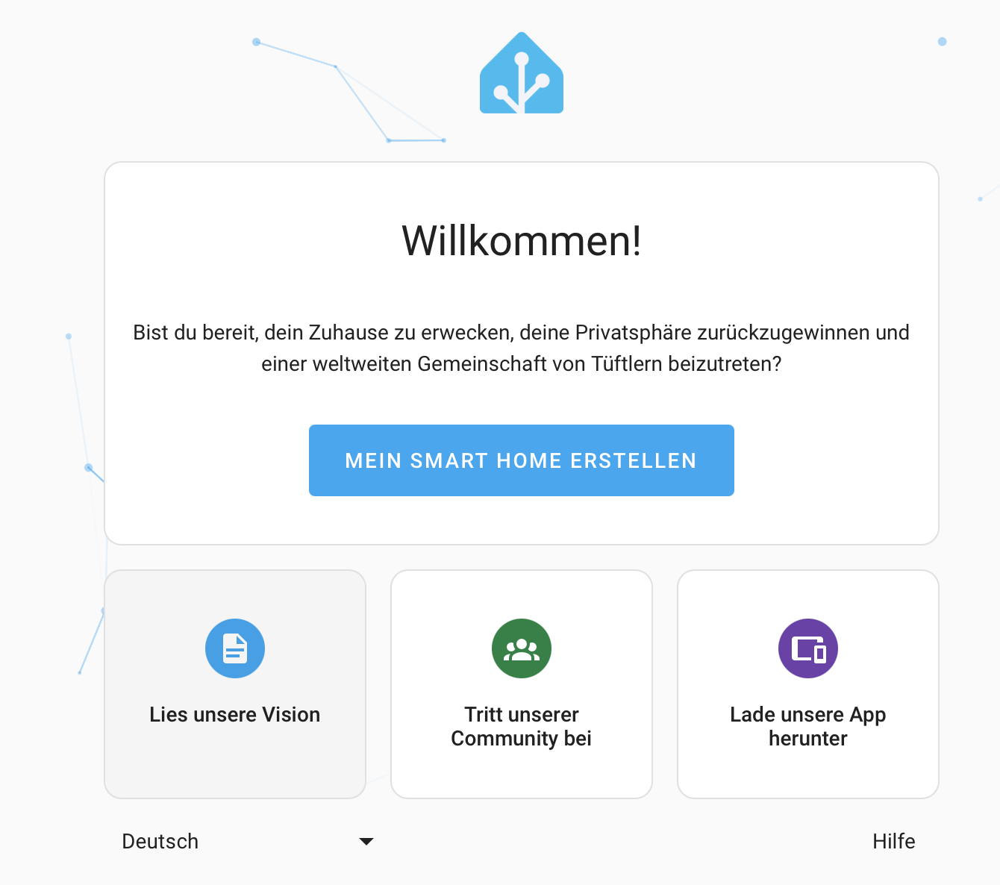
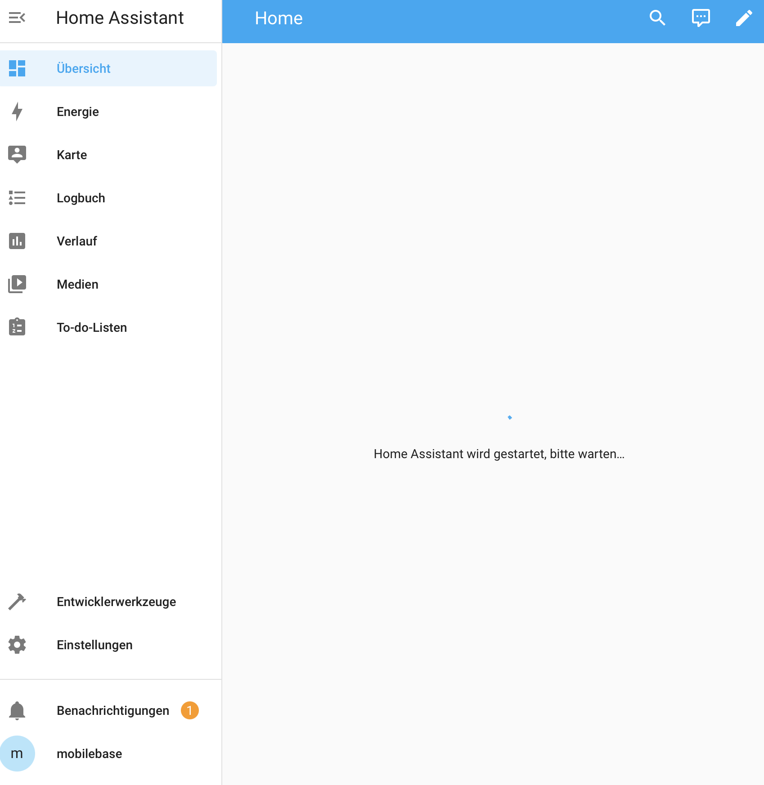

### Install Home Assistant ### 

SD Karte Flashen:

https://www.home-assistant.io/installation/raspberrypi#install-home-assistant-operating-system

- SD Karte in den RPI4 am PeakawayBoard einstetzen
- Strom anschließen
- Wichtig der RPI4 muss mit einem Router mit Internet verbunden sein!
- 5-10min je nach RPI 4/8GB warten

### Config Home Assistant ### 

Im Browser 'http://IP-VOM-RPI:8123/' eingeben, ist euer DNS im Router richtig konfiguriert sollte auch 'http://homeassistant.local:8123' gehen.

Die Schritte zeige ich jetzt nicht im einzelnen sind aber selbterklärend und ihr müsst einfach Homeassistant mit Name, Passwort usw. konfigurieren.

Anschließend Sehen wir eine noch relativ leere Oberfläche.

### Erweiterte Modus einschalten

Unten Links auf den 'Usernamen' klicken um dann den -> Erweiterten Modus einschalten.

-> Neustart! Die installation ist Geschafft! 🥳

-> Nun geht es in der [info.md](./info.md) weiter
